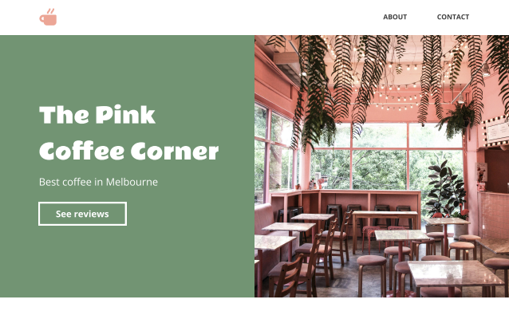
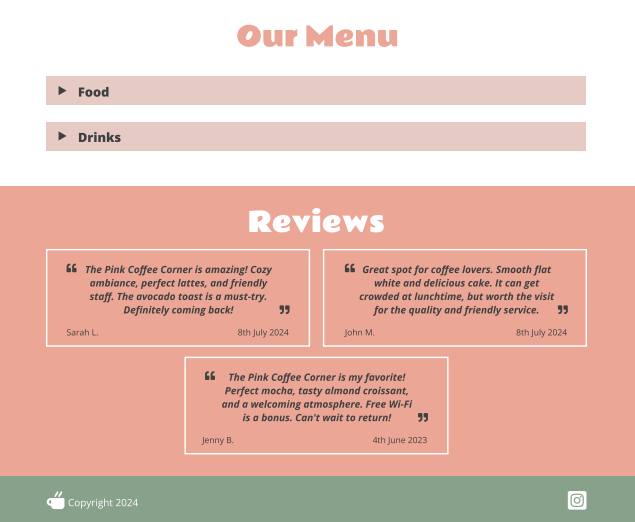
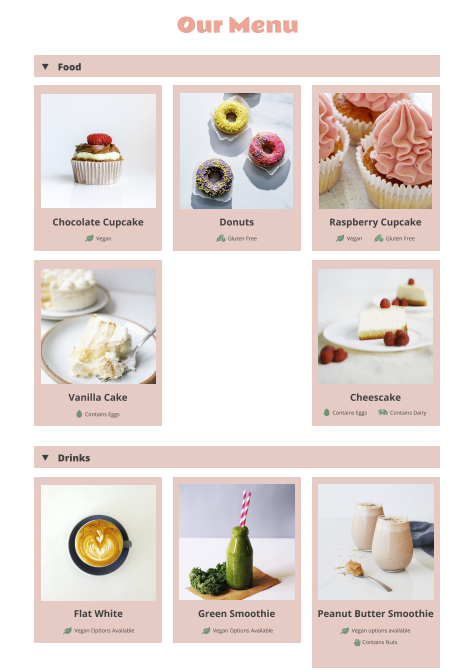
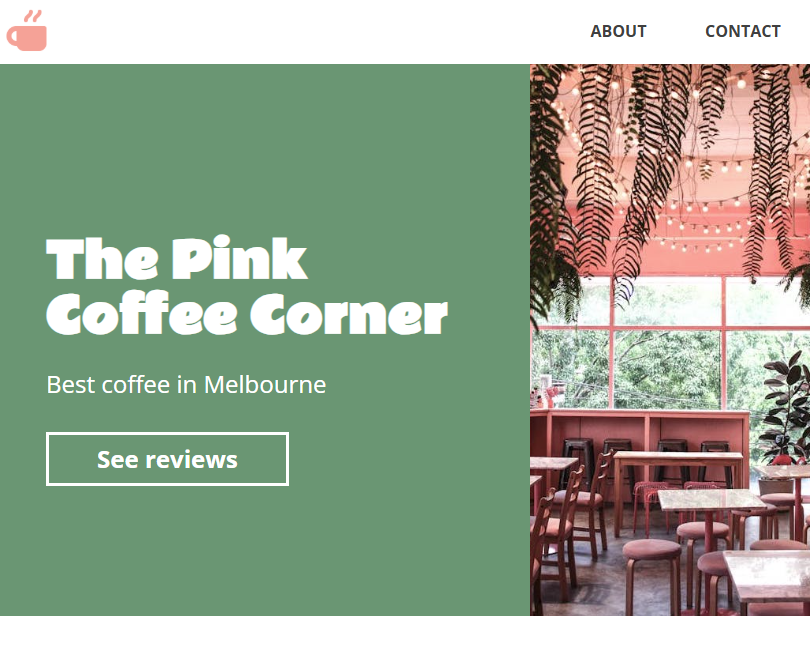
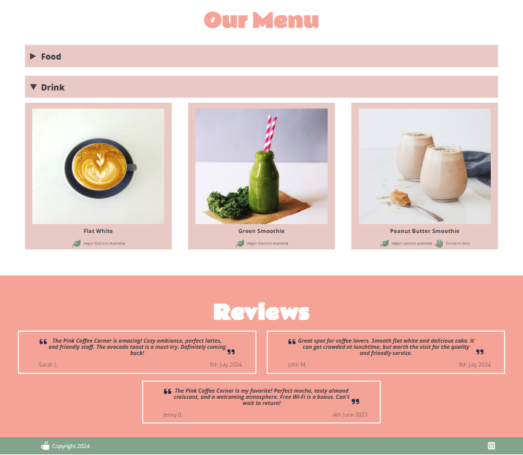
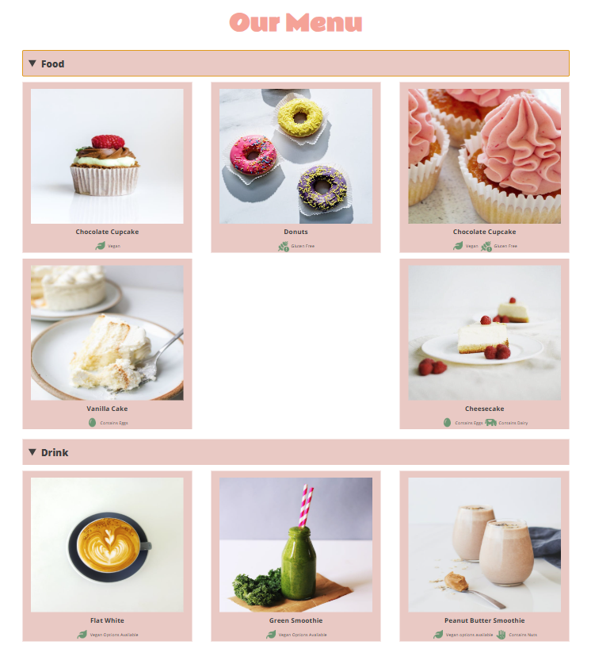

## Fundementals Practice for CSS, HTML & SCSS

Project involves replicating an existing HTML/CSS project without the need for Javascript.

Original HomePage | Menu Before | Menu After

 

My Implementation HomePage | Menu Before | Menu After

 

---

### Goals

Recreate the provided project using HTML, CSS and SCSS.

### Requirements (MVP)

- Nav bar with About + Contact Title
- Homepage
- Menu must be expandable/collapsable with Food & Drinks categories
- Review Section
- Footer

### Bonus

- Review button should be clickable and takes user to review section
- Contact page with fields to input
- Entire section scalable

### Implementation

- Sectioned out each requirement into respective **partials** via html pages
- Imported **sections, stylings, fonts** via **@use @import** methods
- Added styling via scss to peronslise each section with respect to their **fonts, colors, position etc..**
- Made use of **placeholders, partials and mixins** to cut down on repetitive coding
- Followed **BEM conventions** to make files more readable and scalable

### Tech Stack

-[x] HTML   -[x] CSS   -[x] SCSS

### Issues/Questions

- Implementing **.png & .jpg** doesn't allow methods to change image color
- Importing standard images as background images doesn't seem right
- What are conventions with units **(vh, vw, %, px, em, rem)**?
- When to use **mixins VS placholders**?
- BEM convention seems confusing when is something an **Element vs Modifier**
- Better ways to import fonts apart from adding as a **\<link>** tag

### Feedback

- Import image as **.svg** allows modifing size, position, color
- Adding image via **\** is perfectlty fine
- Initial siziing is done via **vh & vw** then **%** is for elements inside blocks and **px, em, rem** for shifting positions
- BEM conventions will be reviewed
- Can link fonts but **@import** fonts

### Takeaways / Learnt Lessons

- Flex Box can contain other Flex Box's
- Draft/plan out structure before implementing
- Units used follow vh&vw -> % -> px,em,rem by top down
- Importing images and fonts can be done via different methods
- Mixins, placeholders cuts down repeatable code
